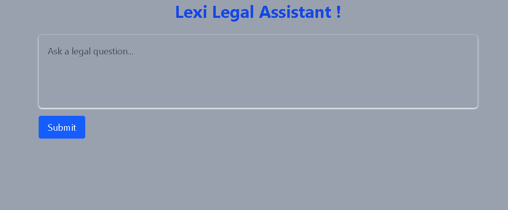
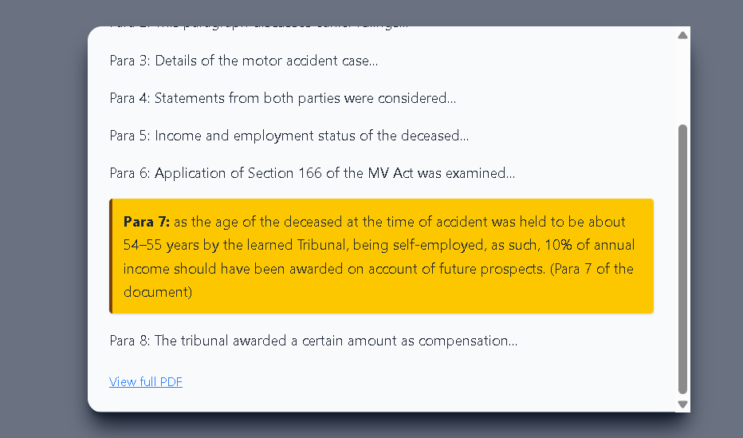
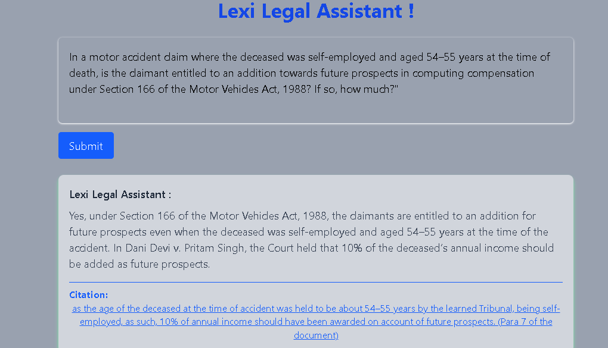

# ⚖️ Lexi Legal Assistant – Frontend Assessment (React)

A minimal, ChatGPT-style legal interface that simulates how **Lexi** helps users get AI-generated legal answers backed by **citations to real documents**.  
Built with ❤️ using React & Tailwind CSS.

---

## 📸 Demo Screenshots

---

##  Features

 Ask a legal question  
 Simulated AI-generated legal answer  
 Clickable citation from judgment  
 Opens a **simulated PDF** with scroll + highlight of **Para 7**  
 Link to the **real PDF on SharePoint**  
 **Fuzzy query matching** (bonus logic)  
 Fully responsive UI  
 Clean Tailwind CSS styling  

---

##  Supported Query

This demo is **limited to one specific legal query** (as per assessment).  

> “In a motor accident claim where the deceased was self-employed and aged 54–55 years at the time of death, is the claimant entitled to an addition towards future prospects in computing compensation under Section 166 of the Motor Vehicles Act, 1988? If so, how much?”

### 💡 Smart Query Matching (Bonus!)
You don’t need to type this word-for-word!  
We use **fuzzy matching** to allow slight variations like:
- Lowercase or missing punctuation
- Reordered phrases

As long as it includes:
`motor accident`, `self-employed`, `section 166`, `motor vehicles act`, `54`

 You'll get the AI answer!

Any unrelated legal question (e.g., Hindu Marriage Act) will show an error:
> _“This demo only supports a specific legal query...”_

---

##  Citation + PDF Simulation

 Clicking the citation:
- Opens a **modal** (mimicking a PDF viewer)
- Auto-scrolls to **Para 7**
- Highlights it with a yellow background
- Also includes a **link to the actual PDF on SharePoint**

### Why Not Real PDF Highlight?

SharePoint PDFs **cannot be embedded or auto-highlighted** due to security restrictions (`X-Frame-Options: DENY`).  
Hence, this UI **simulates PDF scroll + highlight** as per the assignment instructions:

> _“Bonus points if the PDF scrolls to the specific paragraph / highlights the specific text (mock only)”_

---

##  Tech Stack

-  React.js (CRA)
-  Tailwind CSS
-  Conditional rendering 
-  error handling for unsupported queries
---

